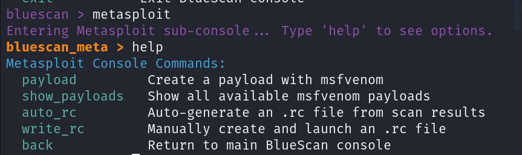

# BlueScan
An interactive penetration testing automation tool written in Bash
# 🔍 BlueScan

**BlueScan** is a fully interactive penetration testing automation tool written in pure Bash.  
It is designed to streamline recon, brute-forcing, vulnerability discovery, and Metasploit integration — all from a persistent terminal menu.

> "Scan smart. Exploit sharp."

---

## ⚙️ Features

- 🎯 **Basic & Full Scans** with Nmap (TCP/UDP + Service & Version detection)
- 🔐 **Weak Credential Brute-Force** (Medusa-based) for SSH, FTP, Telnet, RDP, and Postgres
- 🧠 **Vulnerability Mapping** using Nmap NSE scripts + Searchsploit
- 💣 **Metasploit Integration Menu**  
   - Generate payloads with `msfvenom`  
   - Auto-generate `.rc` files per open port  
   - Launch `multi/handler` or selected exploits  
   - Optional payload delivery (HTTP/FTP/SCP)
- 📦 Export everything into a ZIP archive with all results
- 🔍 Built-in result search with `fzf`
- ✅ Intelligent input validation & stage logging
- ## 🎥 Demo Video
[](https://youtu.be/628iM-Zc8QY)
---


## 🚀 Quick Start

```bash
git clone https://github.com/Heinsenberg-cyber/BlueScan.git
cd BlueScan
chmod +x bluescan.sh
./bluescan.sh
## 📸 Screenshots

### 🧠 Opening Banner


### 🧭 Main Menu


### 💣 Metasploit Sub-Menu


-
